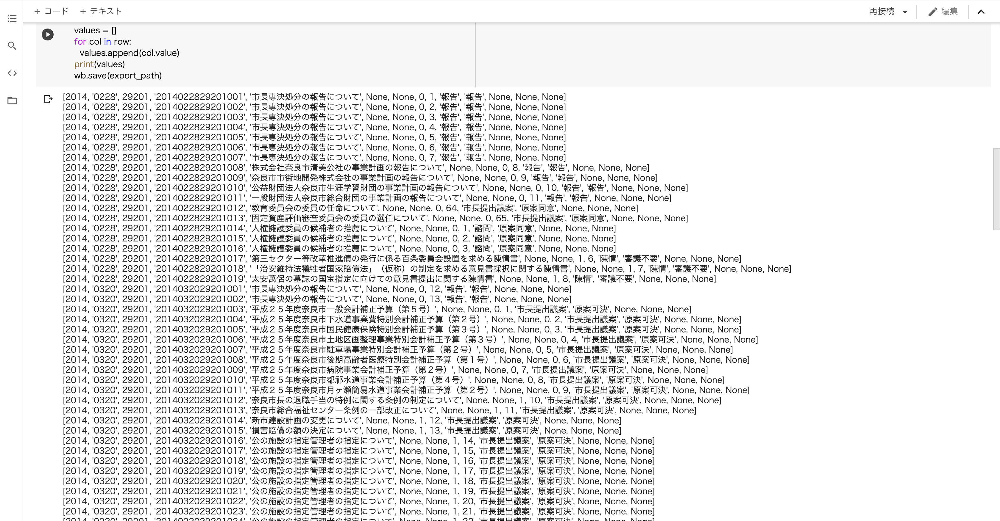
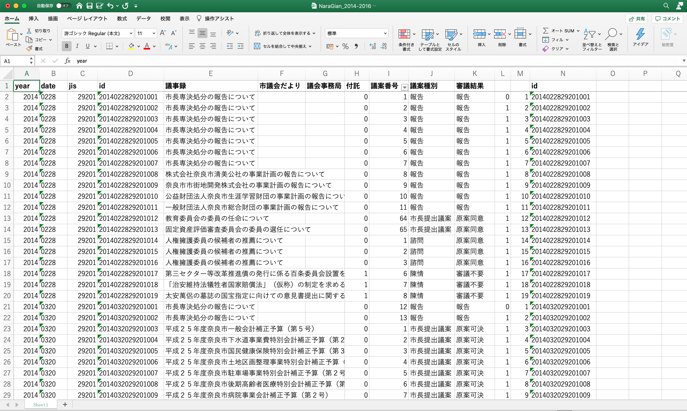

# Xcel-CreateId
## 準備するもの
・Xcel_CreatId.ipynbをダウンロードする  
・Google claboratoryをwebページで開く  
## 使い方
使用前に  
・dateカラムとidカラムは「セルの書式設定」で「文字列」にする（議案データであればB, D, N列）  
・dateカラムが４桁かつ月日がバラバラになっていないか確認する  
　　例）123は1月23日の「0123」なのか12月3日の「1203」なのか分からないため  
・編集したいファイルを予めGoogleドライブに保存しておく  
1. はじめに Google ドライブのファイルへのアクセスを許可する（左のドライブファイルからGoogle ドライブをマウントする）  
2. ```!pip install openpyxl```を実行する  
3. 次のコード内で編集したいファイルのパスを指定する（左のフォルダから編集したいファイルを副ボタンでクリック。「パスをコピー」し、' 'の中に貼り付け）  
4. 次のコード内で保存先のファイルパスと好きなファイル名を指定する  
5. 3.4.で”import_path”と”export_path”を指定したらコードを実行する  
6-0. IDを作成したいデータのプログラムを実行する（議案、委員会）  
6-1. 委員会データの場合、ID作成したい市町村コードを指定してから実行する 
## 実行結果


